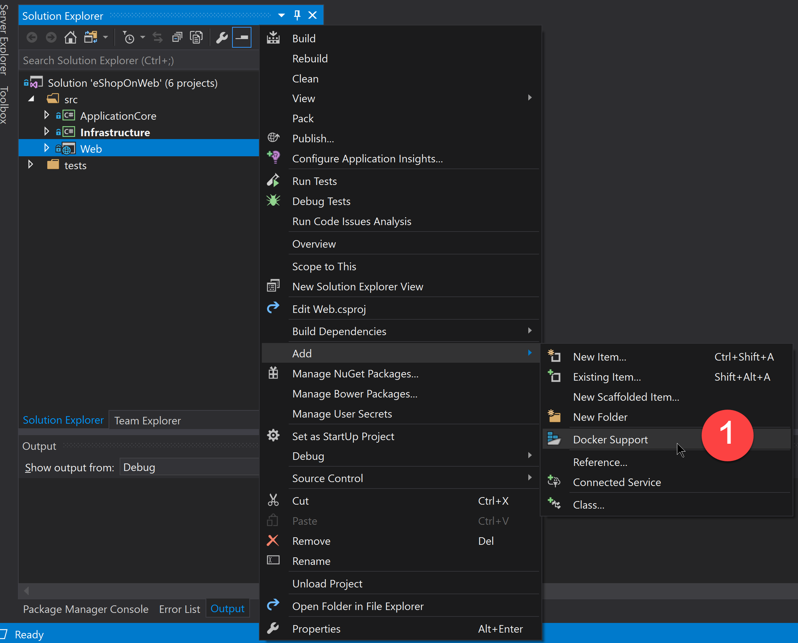
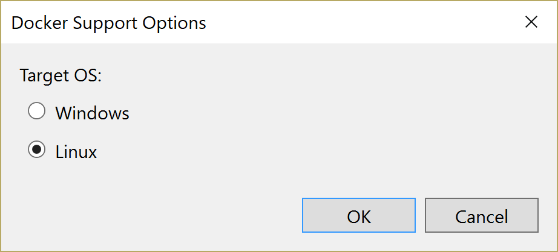
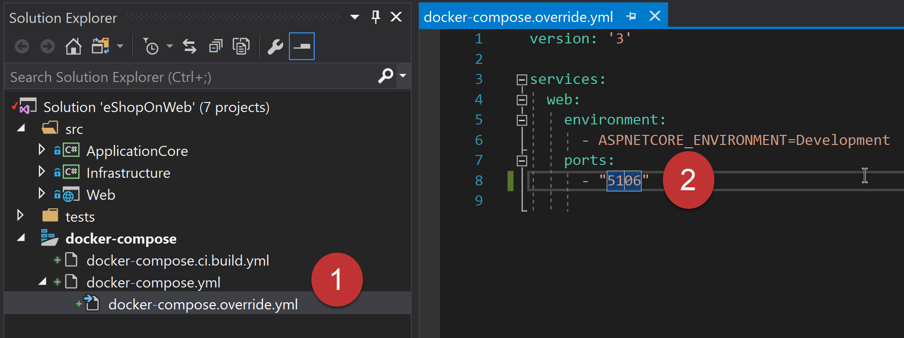
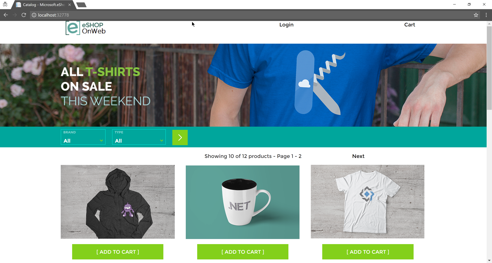

# Running Locally on a Linux Container from VS2017

To deploy the eShopOnWeb sample to a local Linux Docker container, from Visual Studio 2017, follow these step-by-step instructions:

1. Clone or download the eShopOnWeb sample to a folder on your local machine.

2. Ensure that you have installed a recent version of [Docker for Windows](https://www.docker.com/docker-windows)

3. Right click on the `Web` project in Visual Studio and select the `Add` menu then `Docker Support`

4. Select `Linux` and click on `OK`.  This will create a new project in your solution called `docker-compose`. This project contains the settings for deploying to Docker. 

5. Open the `docker-compose.override.yml` from the `docker-compose` project and change the line that reads `80` to read `5106`. This is the port eShopOnWeb is configured to run on. (See the `Program.cs` file for details)

6. Press `F5` to run the project or select `Debug` > `Start Debugging` from the menu.

7. Your default browser will start on a random port on localhost which is forwarded to the docker container. 

## Trouble Shooting

You may encounter an error if your Docker for Windows is configured to run Windows containers. This setting change be changed by right clicking on the tray icon and selecting `Switch to Linux containers`

