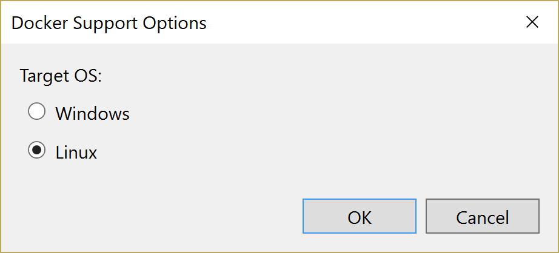

# Deploying as a Linux container into Azure App Services

To deploy the eShopOnWeb sample to Linux Docker container on Azure App Services, from Visual Studio 2017, follow these step-by-step instructions:

1. Clone or download the eShopOnWeb sample to a folder on your local machine.

2. Ensure that you have installed a recent version of [Docker for Windows](https://www.docker.com/docker-windows). You do not need to run Docker containers locally but you will need Docker command line tools to build the image.

3. Right click on the `Web` project in Visual Studio and select the `Add` menu then `Docker Support`


4. Select `Linux` and click on `OK`.  This will create a new project in your solution called `docker-compose`. This project contains the settings for deploying to Docker. 



5. Update the `docker-compose.yml` to listen to forward port 80 to port 5106. Change the line 

```
ports:
      - "80"
```

to

```
ports:
      - "80:5106"
```

6. Right click on the `Web` project and select publish


7. In the publish dialog select `Azure App Service Linux`


8. Fill in the fields in the App Services Dialog. 

-  `App Name` - Name off the app service - this will be used in the default URL
- `Subscription` - Select the Azure subscription to use
- `Resource Group` - Select a resource group to use for all newly created services. You can either use an existing one or create a new one. 
- `App Services Plan` - The name of the app services plan to use. This can be an existing App Service or a new one
- `Container Registry` - The instance of Azure Container Registry to use to hold the images to deploy. This can be an existing registry or a new one. 

9. Click `Create` to provision the resources on Azure. 


10. Once the deployment is complete a browser will open with the newly containerized application running on a Linux App Service

