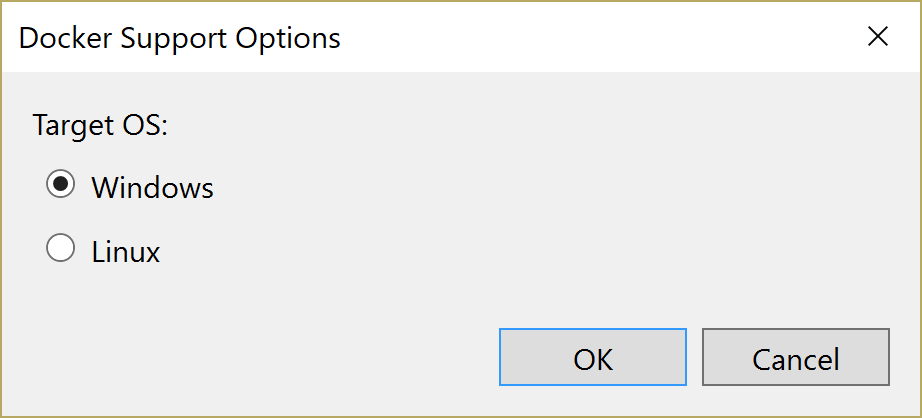
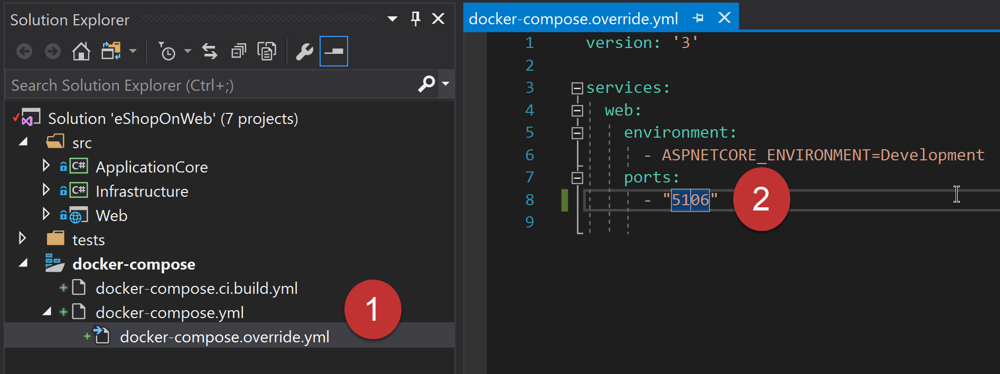
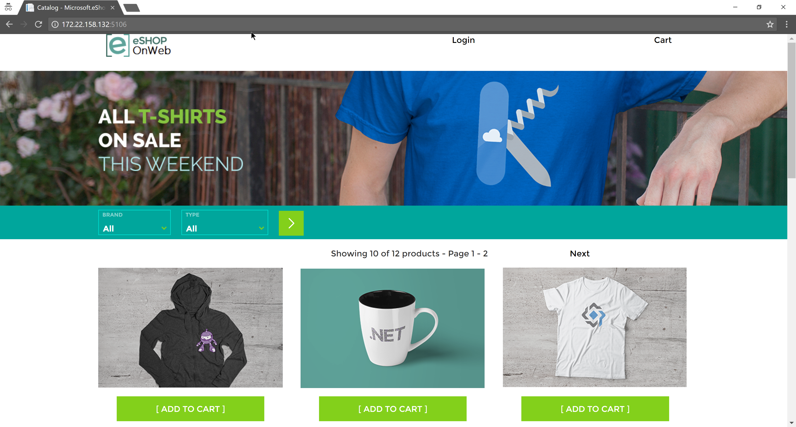
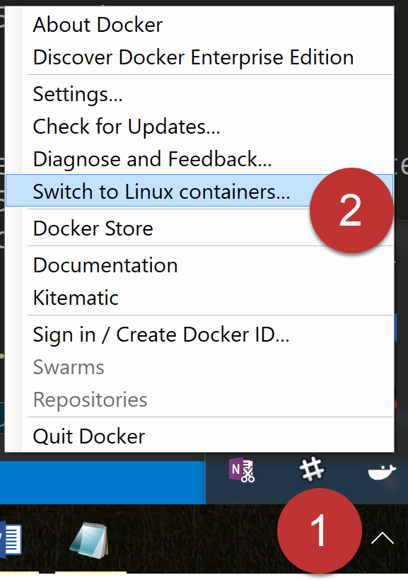

# Running locally on a Windows Container from VS 2017

To deploy the eShopOnWeb sample to a local Windows Docker container, from Visual Studio 2017, follow these step-by-step instructions:

1. Clone or download the eShopOnWeb sample to a folder on your local machine.

2. Ensure the computer on which you're running has Windows containers enabled. You can read how perform the one-time setup on the [Docker Blog](https://blog.docker.com/2016/09/build-your-first-docker-windows-server-container/)

3. Right click on the `Web` project in Visual Studio and select the `Add` menu then `Docker Support`  


4. Select `Windows` and click on `OK`.  This will create a new project in your solution called `docker-compose`. This project contains the settings for deploying to Docker. 



5. Open the `docker-compose.override.yml` from the `docker-compose` project and change the line that reads `80` to read `5106`. This is the port eShopOnWeb is configured to run on. (See the `Program.cs` file for details)



6. Find the name of the running container. (Windows containers currently have a limitation when working with Network Address Translation and localhost. It is expected to be corrected as the ecosystem evolves. [Details](https://docs.docker.com/docker-for-windows/troubleshoot/#limitations-of-windows-containers-for-localhost-and-published-ports)).  To find the name open a command prompt and run 

```
docker ps
```

This should give output similar to 

```
CONTAINER ID        IMAGE               COMMAND                  CREATED             STATUS
          PORTS                             NAMES
9dbd37174f6c        web:dev             "powershell -Comma..."   2 minutes ago      Up 2 minutes       80/tcp, 0.0.0.0:29887->5106/tcp   dockercompose3095019296207330533_web_1
```

The final field starting with `dockercompose...` is the name of the running container.

7. Find the ip address of the running container by entering 

```
docker inspect [[container name from previous step]] --format='{{range .NetworkSettings.Networks}}{{.IPAddress}}{{end}}'
```


8. Open a web browser and enter the IP address from the previous step in the URL along with port `5106`. For instance if the given IP is `172.22.158.132` then the URL should be `http://172.22.158.132:5106/`



## Troubleshooting

You may encounter an error if your Docker for Windows is configured to run Linux containers. This setting may be changed by right clicking on the tray icon and selecting `Switch to Windows containers`

