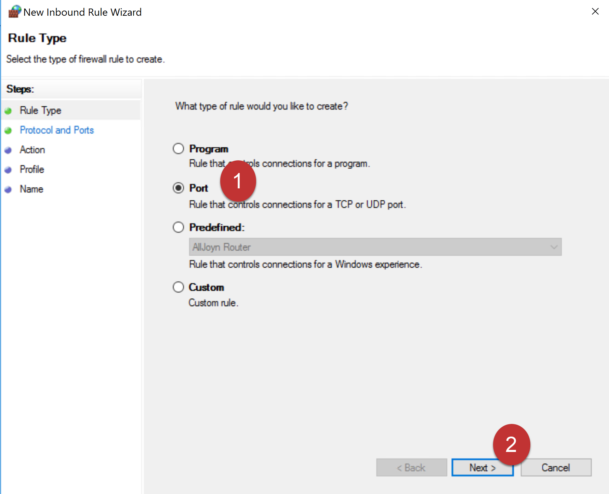
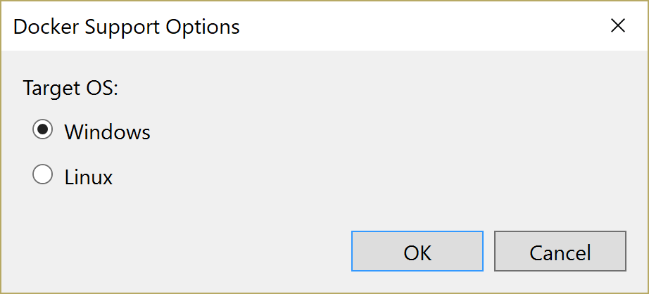

To deploy the eShopOnWeb sample to a Windows 2016 virtual machine running Docker on Azure, from Visual Studio 2017, follow these step-by-step instructions:

## Provision a Virtual Machine to Host Docker

1. Log into Azure and click on the plus symbol(`+`) to create a new resource. Then select `compute` and `see all`


2. In the search box enter `containers` and then select `Windows Server 2016 Datacenter - with Containers`


3. Click create


4. Enter a name for the virtual machine. Also provide a user name and a password to log into the virtual machine. Be sure to record the password as it will be needed in subsequent steps. Choose either an existing resource group or create a new one. Finally, click `select`


5. Select a size for the virtual machine. DS1_V2 is sufficient for our needs. Click `select`


6. In the settings click on `Network security group` then click `Add inbound rule`


7. Create a rule to expose the Docker agent port, 2375, by entering a name for the rule, a priority and the port. Click `Ok`


8. Create a rule to expose the Web Server which will be running on the Docker agent. Entering a name for the rule, a priority and select `HTTP` from the `Service` drop down. Click `Ok`


9. Click `Ok` on the settings blade
10. On the purchase blade click `Purchase`


11. The virtual machine will now be provisioned. Click on `Virtual Machiens` and then select your new virtual machine. 


12. Click on `Connect` to download the remote connection file for the virtual machine. You may also wish to record the IP address of your machine at this time - it will be needed later.


## Configuring Docker on the Virtual Machine

1. Launch the connection by clicking on the downloaded connection file


2. Agree to connect 


3. Enter the password and user name recorded earlier. You may need to click on `More Choices` to access the user name and password boxes. Click on `OK`


4. The firewall on the server must now have ports opened to allow access to the Docker daemon and container. Click on the start menu and enter `firewall` then click on the `Windows Firewall with Advanced Security`


5. In the firewall settings click on `Inbound Rules` then `New Rule...`


6. Select `Port` as the rule type and click `Next`



7. Select `Specific local ports` and enter `2375`. Click `Next`

 

8. Select `Allow the connection` and click `Next`

 

9. Leave the settings on the Profile page unchanged and click `Next`

 

10. Enter a name such as `Docker` for the firewall rule and click `Finish`

 

11. In the firewall settings click on `Inbound Rules` then `New Rule...`


12. Select `Port` as the rule type and click `Next`


13. Select `Specific local ports` and enter `80`. Click `Next`

 

14. Select `Allow the connection` and click `Next`

 

15. Leave the settings on the Profile page unchanged and click `Next`

 

16. Enter a name such as `Web` for the firewall rule and click `Finish`

 

17. By default the Docker daemon doesn't listen on external ports so we need to enable that. Open an administrative powershell window and enter 

    ```
    stop-service docker
    &"C:\Program Files\Docker\dockerd.exe" -H tcp://0.0.0.0:2375
    ```

     

    The server should now be set up to allow remote Docker connections. **Note**: It is not secure to run the Docker daemon exposed to the Internet and without any authentication. For the purposes of this tutorial we'll allow it but in real world applications [other approaches are recommended](https://docs.docker.com/engine/security/https/).  

## Configure Your Computer to Talk to Docker on the Virtual Machine

Your computer needs to be configured to talk to the Docker daemon on the virtual machine that was just set up. To do this we'll need to set an environment variable pointing Docker to the remote daemon. 

1. Click on the `start` button and search for `computer`. Right click on `This PC` and select `properties`


2. Select `Advanced system settings`


3. Click `Environment Variables`


4. Add a new system variable called `DOCKER_HOST` set it to be `tcp://<ip address of your virtual machine>:2375`


## Build and Run the Container 

1. Clone or download the eShopOnWeb sample to a folder on your local machine.

2. Ensure the computer on which you're running has Windows containers enabled. You can read how perform the one-time setup on the [Docker Blog](https://blog.docker.com/2016/09/build-your-first-docker-windows-server-container/)

3. Right click on the `Web` project in Visual Studio and select the `Add` menu then `Docker Support`  


4. Select `Windows` and click on `OK`.  This will create a new project in your solution called `docker-compose`. This project contains the settings for deploying to Docker. 




5. Update the `docker-compose.yml` to listen to forward port 80 to port 5106. Change the line 

```
ports:
      - "80"
```

to

```
ports:
      - "80:5106"
```

6. Build the project under `Release` configuration. This will deploy the image to the remote Docker daemon

7. Open an instance of powershell and run 

```
  docker run -p <ip address of your virtual machine>:80:80 web -t
```

8. Direct your web browser to http://<ip address of your virtual machine>. You should see an instance of the eShopOnline site running

